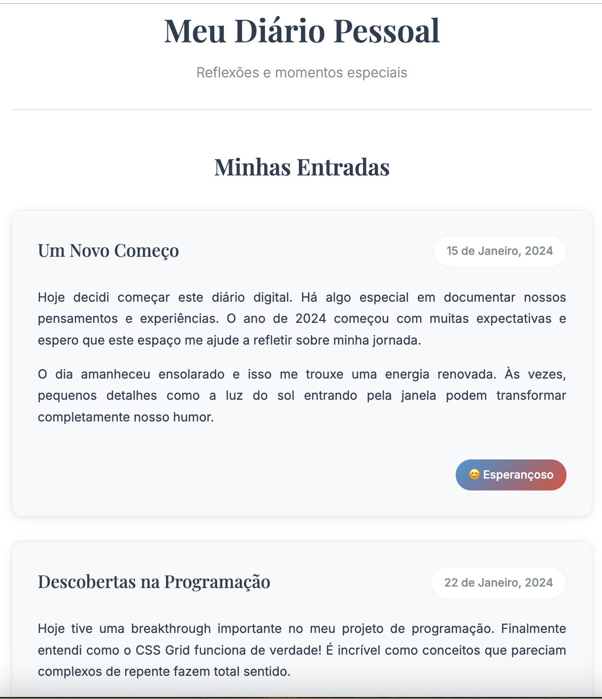

# PROJETO 1 - Diario_Boticário_Koru

## Projeto: Página de Diário Pessoal ✍️

## Tecnologias Utilizadas

- HTML5 Semântico
- CSS3 com Flexbox/Grid
- Google Fonts
- Dark Mode (opcional)

## 📓 Entrega

Até dia 07/07/2025 (até às 18:30) - Link do deploy e/ou do código no grupo de projeto específico (grupo 1, grupo 2, grupo 3...).

**Este é um [deploy](http://gusty-rice.surge.sh/) para o surge(Local de hospedagem do projeto).**

**[Link](https://github.com/Fernando-Roque/boticario-koru-Projeto1) para o Github do projeto.**

## Descrição

Neste projeto, os alunos aplicarão os conhecimentos de HTML e CSS acumulados até agora para construir seu primeiro projeto pessoal significativo: uma página web de "Journaling" (Diário Pessoal). O foco principal será na utilização correta de **HTML semântico** para estruturar as entradas do diário e na aplicação de **CSS** para estilizar a página, tornando-a visualmente agradável.

Uma particularidade deste projeto é que as **_entradas do diário serão adicionadas diretamente no código fonte HTML_**, servindo como prática de estruturação de conteúdo estático. Layouts com Flexbox ou Grid são incentivados para organizar os elementos na página.

Como desafios extras (opcionais), exploraremos a implementação de um modo escuro (Dark Mode) automático.

**Conceitos a aplicar:** HTML semântico (`<article>, <section>, <header>, <footer>, <time>`, etc.), estrutura HTML completa, linkagem de CSS externo, estilização com CSS (cores, fontes, espaçamentos, bordas), layout com Flexbox e/ou Grid, (Opcional) CSS Variables, (Opcional) Media Query `prefers-color-scheme`.
**Atividade Principal:** Criar um arquivo `index.html` e `style.css` para a página de journaling, estruturar semanticamente algumas entradas de exemplo diretamente no HTML, e estilizar a página de forma atraente usando CSS.`
**Ênfase:** Integração prática de HTML e CSS, criação de um layout coeso, atenção à semântica do HTML e à estética visual da página.

## 🎯 Objetivos

Os alunos deverão ser capazes de estruturar conteúdo de forma semântica usando HTML:
Aplicar tags como `<main>, <article>, <header>, <footer>, <time>, <h2>, 
` de forma apropriada para criar entradas de diário estáticas.
Os alunos deverão ser capazes de estilizar uma página web usando CSS:
Aplicar propriedades de estilo (cores, fundos, fontes - incluindo Google Fonts, margens, preenchimentos, bordas) para criar uma aparência visual agradável.
Utilizar Flexbox e/ou Grid para controlar o layout geral da página e o arranjo das entradas do diário.
Linkar corretamente um arquivo CSS externo ao documento HTML.
Os alunos deverão consolidar o fluxo de trabalho básico de desenvolvimento frontend:
Criar e organizar arquivos de projeto (HTML, CSS).
Utilizar o VSCode e o Live Server para desenvolvimento e visualização em tempo real.
Os alunos deverão realizar o Deploy do projeto:
Publicar uma página estática no Surge.sh ou outro local.
(Opcional) Os alunos deverão entender o conceito básico de:
Implementar um Dark Mode usando CSS Variables e `prefers-color-scheme`.

## Dicas para o Projeto

**Inspiração:** Procure por "journal web design", "blog design" para ideias visuais. Use sites como [Coolors.co](https://coolors.co/) para paletas de cores.

**Semântica**: Pense no significado do conteúdo ao escolher as tags HTML.

**DevTools (F12)**: Seu melhor amigo para testar CSS! Use o inspetor de elementos para ver quais estilos estão sendo aplicados e experimentar novos valores.

**Iteração:** Comece simples (estrutura e layout básico) e adicione complexidade e detalhes de estilo gradualmente.

**Fontes:** Use Google Fonts para dar um toque profissional à tipografia.

### Autor : Fernando Maurício Roque

📬 Envie um email para mim : [fernando.mauricio.roque@gmail.com](mailto:fernando.mauricio.roque@gmail.com)
